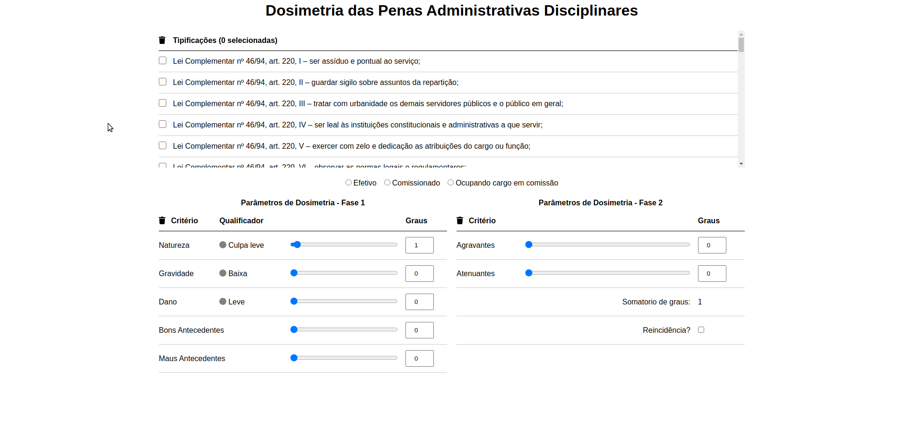

<h1 align="center">
    
</h1>

<h2 align="center"> 
	  Calculadora de Dosimetria das Penas Administrativas
</h2>

<p align="center">
 <a href="#📷-demonstração">Demonstração</a> •
 <a href="#ℹ️-sobre">Sobre</a> • 
 <a href="#🛠-tecnologias">Tecnologias</a> • 
 <a href="#🔗-link-do-projeto">Link do projeto</a> • 
 <a href="#🚀-como-executar">Como executar</a> •
 <a href="#📚-aprendizados">Aprendizados</a> • 
 <a href="#👨‍💻-autor">Autor</a> • 
 
</p>

<p align="center">
  <a href="https://www.linkedin.com/in/rodrigovitoriense/">

</a>

</p><br>

# 📷 Demonstração




<br>

# ℹ️ Sobre

<p>
Calculadora criada para realizar cálculos de dosimetrias de penas administrativas disciplinares baseadas nos artigos 220,221 e 234 da Lei Complementar nº 46/94, além do artigo 23 da Lei Estadual nº 9871/12.
</p>
  <br>

# 🛠 Tecnologias

As seguintes tecnologias foram utilizadas na construção do projeto:

- [ReactJS](https://reactjs.org/)
- [TypeScript](https://www.typescriptlang.org/)
- [Styled Components](https://styled-components.com/)
  <br><br>

# 🔗 Link do projeto

- Link de demonstração do projeto: [Calculadora de Dosimetria das Penas Administrativas](https://calculadora-dosimetria.vercel.app/)
  <br>

# 🚀 Como executar

Clone o projeto e acesse a pasta.

```
$ git clone https://github.com/rodrigorvix/calculadora-dosimetria.git
$ cd calculadora-dosimetria
```

Siga os passos abaixo:

```
# Install the dependencies
$ yarn ou npm

# Start the project
$ yarn start
```

O aplicativo estará disponível para acesso pelo seu navegador em http://localhost:3000
 <br>

# 📚 Aprendizados
 

 ## React:
    - Conceitos e uso de componentes, propriedades e estados;
    - Hooks;
    - Contextos.

 ## TypeScript:
    - Tipagem de variáveis;
    - Melhoria na descoberta de falhas e bugs.
  
  <br>
  
# 👨‍💻 Autor

- [Linkedin](https://www.linkedin.com/in/rodrigovitoriense/)
- [GitHub](https://github.com/rodrigorvix)
  <br>


